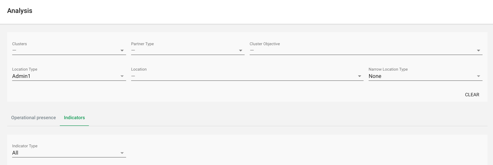
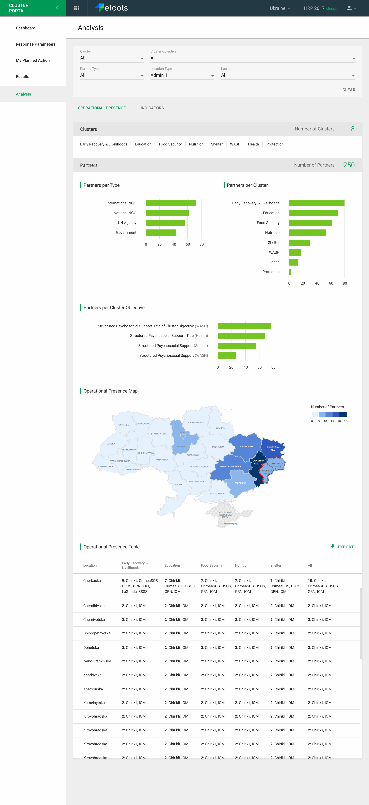
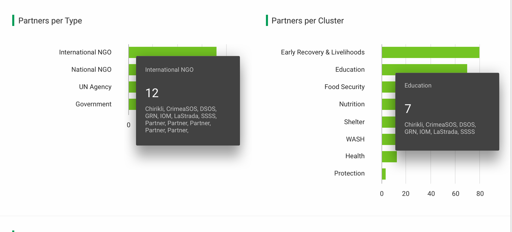
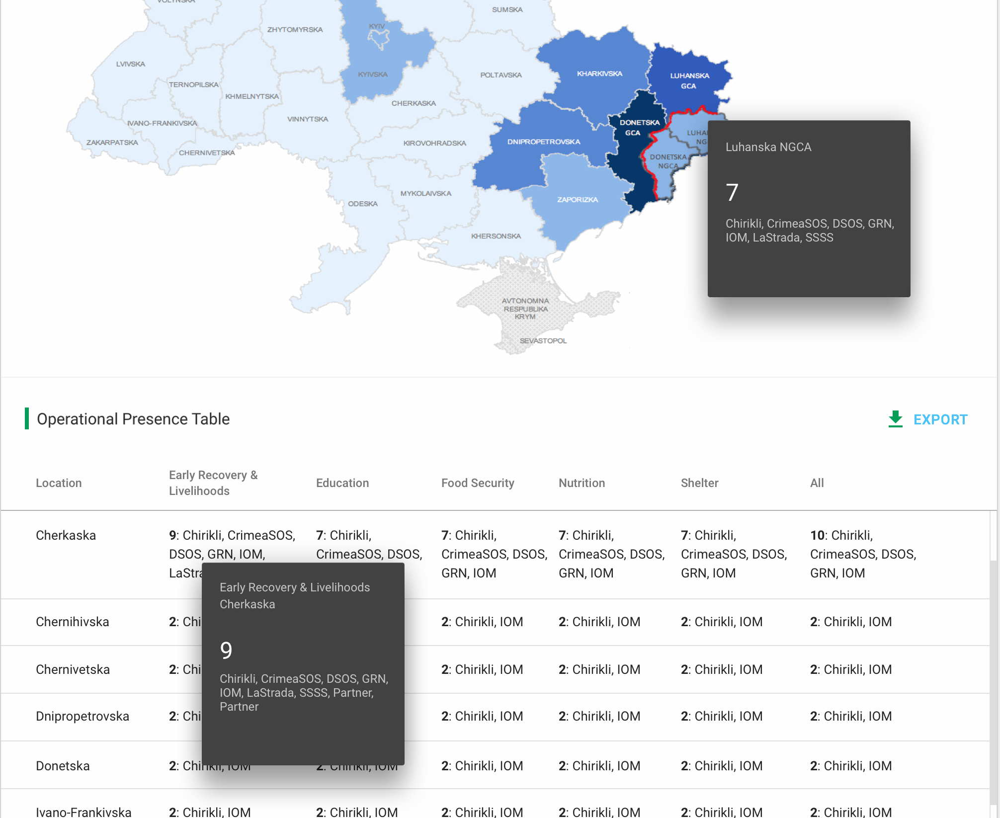
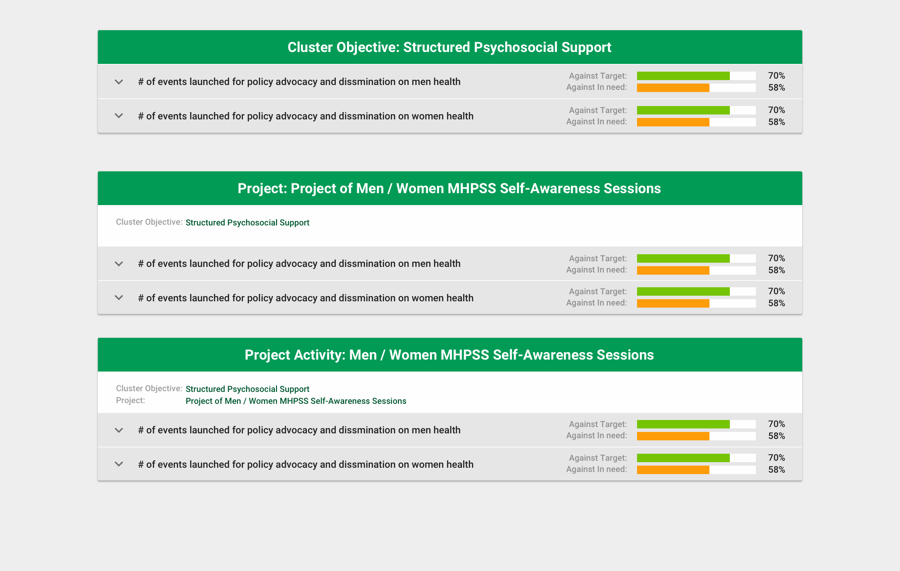
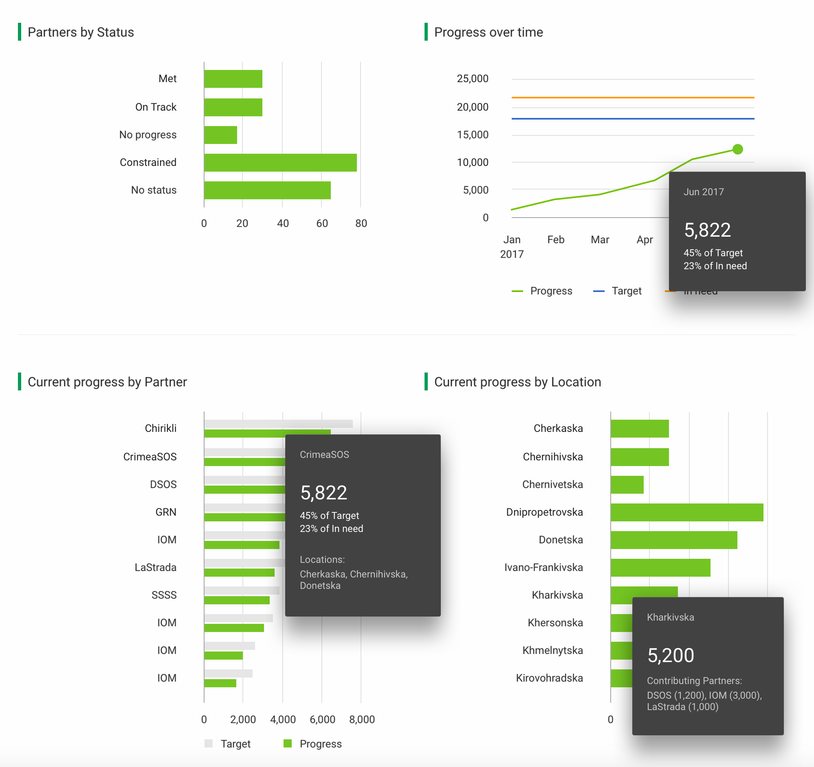
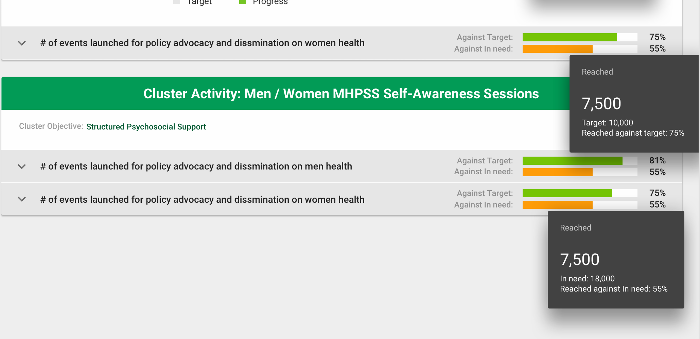

# Analysis of results

In this section \("Analysis" in the left hand navigation\) of the interface users can conduct analysis for a particular response plan and get a sense of progress/work being done. High level they can see the operational presence \(which partners, in which clusters, in which locations etc.\) and progress that indicators are making.

## Filters

To perform any analysis the user can filter the data by the following filters:

* Cluster\(s\) \[default:All\]
* Cluster Objective\(s\) \[default:All\]
* Partner Type\(s\) \[default:All\]
* Location Type \(Admin level\) \[default:?\]
* Location\(s\) \[default:All\]
* Narrow Location Type \[default:None\]
* Indicator Type \[default:Cluster Activity\] - available in Indicators tab \(not as a global filter\);

## Operational Presence

This tab shows the following information \(see screenshot for layout / details below\):

* Clusters \(with Number of Clusters\)
* Partners per Type - divided by: International NGO, National NGO, UN Agency, Government;
* Partners per Cluster Objective - user can see a title of objective with the title of Cluster, it refers to.
* Operational Presence Map - depending on selected location, user can see a map with colors showing the number of Partners in each location in the country. Zoom in/out capabilities will be there as well.
* Operational Presence Table - table is showing number of Partners \(with a name of a Partner\) working in each Cluster in each location. Table is exportable. It's also scrollable horizontally \(in case of large number of Clusters\) and vertically. 

Charts are presenting information in descending order.


On any charts, where we are referring to Partners, we are showing targets set by Partners themselves.


**Hover behavior**: on hover user has an access to the information about number of Partners and names of Partners working in each Cluster, location, type, etc.

## Indicators

The indicators are grouped into sections based on what they are associated with the "Indicator Type" selected from the dropdown. The default type being Cluster Activity. All Cluster Activities will be shown \(depending on filters selected\) with their indicators within them. Progress against target and against in-need will be shown when indicator is closed. Target shown here is a Cluster Target \(set by IMO\).

Once indicator is clicked then user has an access to the information about:

* Indicator type
* Reporting frequency
* Number of Partners Reporting
* Number of Reached
* Baseline
* Target
* In need

Below there are charts showing for this Indicator:

* Partners by Status \(Met, On track, No progress, Constrained, No status - in fixed, not descending, order\);
* Progress over time - showing data for Progress, Target and In need with frequency equal reporting frequency;
* Current Progress by Partner - showing progress made by Partner with reference to the target set by this Partner for this Indicator;
* Progress by Location - showing progress in each location \(made by all Contributing Partners in this location\).

See screenshot below for details:

Indicator types, that can be displayed here:

* Cluster Activity Indicator - described above;
* Cluster Objective Indicator - grouped by Objective Indicator and structured the same as Cluster Activity Indicator, the difference is: information about Cluster Objective is not shown under green header but inside green header;
* Project Indicators - grouped by project \(project's title is shown on a green header\), with information about Cluster Objective below. 
* Project Activity Indicators - grouped by project activity \(project activity's title is shown on a green header\), with information about Cluster Objective and Project below.


Both the target and the in-need for each indicator below has been set by the IMO, against which then, progress is shown in green and orange colors.


**Hover behavior**:

* Partners by Status - showing number and names of Partners for each status;
* Progress over time - showing progress for selected moment in time with referring information about percentage of target and in need reached;
* Current Progress by Partner - showing progress for selected Partner with referring information about percentage of target and in need reached and also locations that this Partner is working in, on this Indicator;
* Progress by Location - showing progress for selected location with information about Contributing Partners \(working in this location, on this Indicator\) and their individual progress in this location.
* Against Target - number of Reached, information \(number\) about target and percentage of Reached against target;
* Against In need - number of Reached, information \(number\) about In need and percentage of Reached against In need.

## Open questions + Responses

* Do we really want each partner to provide "In need" figures, there will be certainly some overlaps between 1 partner and another figures. -  **if they have it, yes. i.e. optional**
* Project indicators are partner specific and project activity \(custom\) indicators are as well. Proposing to in indicators tab just showing cluster objective and cluster activity as options for now?

## 

