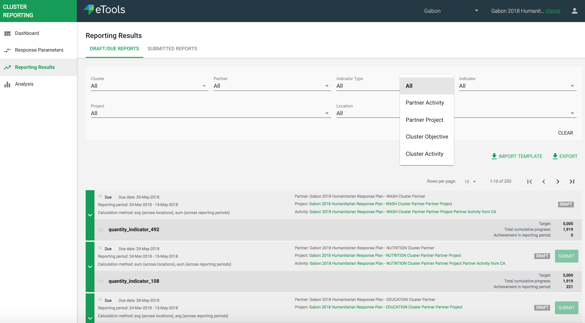
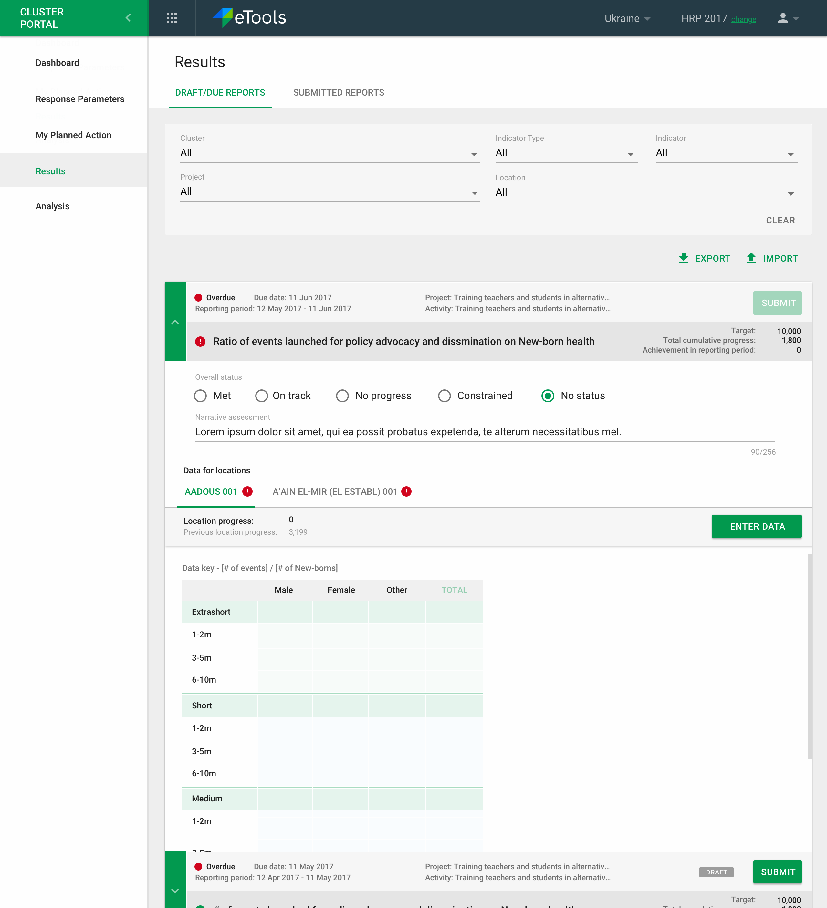

# Reporting on results

In this section \("Reporting Results" in the left hand navigation\) of the interface partners can come and report in the indicator reports that are due. IMO's can do the same for any partner and submit data on their behalf. Interface is split into:

* Draft/Due reports \(default tab\)
* Submitted reports


**Partners do not create indicator reports** in PRP. These are auto-generated for them at a frequency as setup/agreed upon at the indicator level either by them or the IMO, depending on what this indicator is associated with.


The reports list can be filtered by cluster, partner \(defaults to the partner to whom this user is associated with, if its a partner user\), indicator, indicator type etc.

Indicator type options will be: Partner Activity, Partner Project, Cluster Objective, and Cluster Activity.

### Entering data

For each indicator report the partner can enter progress data for each location in which this indicator is being tracked. Additionally they can give an "overall status" and narrative assessment as well.

We will have a data key to specify the labels of the indicators that are set in the add/edit indicators. The data key will be available when IMO edit’s locations or IMO/Partner reports on data for all indicators \(quantity, ratio, percent\).

### Submitting an indicator report

Once all the data for all locations has been entered the indicator report can be submitted. Once submitted the indicator report goes under "Submitted Reports" tab, and can be reviewed by the IMO. Once submitted, none of the report data can be modified by anyone. The IMO may send back the report and add feedback/comments if they would like to see changes to the report.

The Partner will see the report the Draft/Due Column with a ‘Sent Back’ notice. They will be able to make the appropriate edits and re-submit.

### Import / Export of data

Users will be able to export data they see here. Additionally they will be able to export an "import template" which they can then use to import data back into the system.

Here is a link to an example export of multiple reports: [https://docs.google.com/spreadsheets/d/1q5KdU2dRckCEqsJB5pVC3ZLmDMzZDeT8-kK1F3Tn\_mA/edit?usp=sharing](https://docs.google.com/spreadsheets/d/1q5KdU2dRckCEqsJB5pVC3ZLmDMzZDeT8-kK1F3Tn_mA/edit?usp=sharing)

The import template should include multiple rows with indicators, locations etc and data on targets, in-need, baseline \(where available in PRP\). The only thing that should be blank \(no data\) should be the achieved data that the partner will report on. If they have not stated targets in PRP then that column might have no data and could also be filled in the import template.  

### Workflow of Indicator Reports

By default indicator reports go into accepted state once submitted by a partner. The IMO can decide to "send back" a report for revision.

