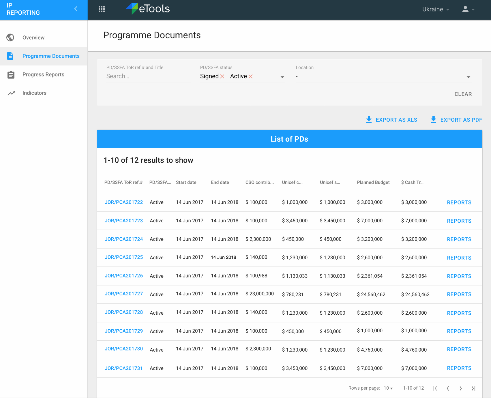
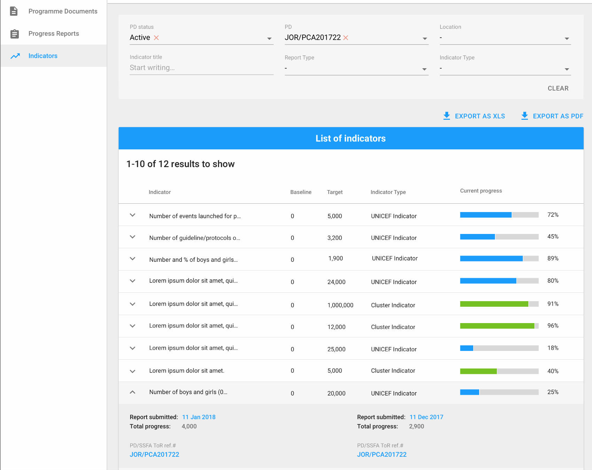

# User Interface

The overall user interface for IP Reporting consists of the following sections. Click on each tab below for more details:



Gives partner details and risk ratings. This data comes from the PMP system and displayed to the partner for their information only. This data cannot be modified in PRP.



Filterable \(defaults to signed and active PD's\) list of the PD's associated with the partner. Can filter by ref \#, title, pd status and location. Report \# will not be on the PD list page.

Clicking a PD will give more details \(shown in mockup below\) about this PD, its associated reports \(separate tab\), and also being able to set the [method of calculation](setting-calculation-methods-for-indicators.md) \(separate tab\) for each indicator associated with each output \(LLO\) within this PD.

Additionally we will show a "Reporting Requirements" in a blue box, under which will have all reports in the future. The columns will be:

* Report name
* Due date
* Reporting period

Nothing in it is clickable.

This data comes from the PMP system and displayed to the partner for their information only. It cannot be modified in PRP.



Filterable list of the Progress Reports associated with all the various PD's of this partner. The user does not generate progress reports, but these are generated periodically/automatically for the partner based on the reporting periods and due dates set by the PO at UNICEF.

See the [progress reports section](progress-reports/) for more details on submission process, various statuses etc. of a progress report.

### Progress Reports - list view

The default list view for progress reports will be status, sent back and due report, and report type: QPR, HR & SR. The partner will have the ability to select a different report status to show all reports. The columns in progress report list will also be sortable.




Filterable list of all the indicators associated with all the PD's for this partner who is signed in. This view shows the progress % against each indicators target.

By default PD status will be selected to "Active". The user can change this as desired.

Unicef/Cluster indicators and show report type. Partners can find high frequency from report type. Dates format should be day/month/year.

**PD \(UNICEF only\) indicator or High Frequency non-cluster indicator**

Clicking on details of each PD \(UNICEF only\) indicator or High Frequency non-cluster indicator will show the latest and previous to latest data reported against that indicator by this partner. This data is part of an indicator report, which could be in a QPR \(in case of PD UNICEF indicator\) or a QPR / HR \(in case of high frequency non-cluster indicator\). The PD blue hyperlink will lead to the specific PD and the date blue hyperlink will lead to that specific report.

The latest and previous to latest is always decided based on the "end date" of the report \(whether QPR or HR, doesn't matter\).

Report data shown will be for Indicator Reports that have been marked either submitted or accepted \(received in cluster\).

**Cluster Indicators**

For cluster indicators, the behavior described above still applies. 



