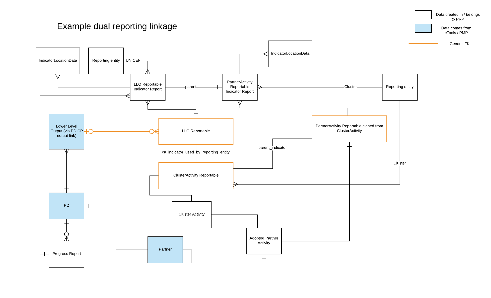

# Data Model

The high-level conceptual data model for the product is below. Its designed in a way to support the requirements of generic reporting against indicators, but also specific reporting requirements that may come along.


The indicators \(Reportables in the data model\) can be associated via a generic foreign key to any other model, keeping it generic and expandable in the future


### Handling reporting on indicators by multiple reporting entities

See [Reporting to UNICEF](../product-end-user-documentation/cluster-reporting/reporting-on-results/reporting-to-unicef.md).

PRP treats/handles a reporting on indicator differently depending on the underlying reporting environment: IP reporting or Cluster reporting.

However, there are scenarios where a participating Partner needs to report on indicators that are relevant to Cluster and UNICEF environment at the same time. In other words, a work the Partner user is doing contributes a progress to both Cluster and UNICEF reporting worlds via **linkable** indicators. Without a way to apply same reporting data to both reporting world respectively, the Partner has to report same reporting data in both environments separately. Therefore, a subset of new data model changes was necessary.

This introduces a new data model that is dedicated for dual reporting purposes: **Reporting entity**. Reporting entity data model now marks IndicatorReport instance with what representation the Partner used to report data.

With this model, any IndicatorLocationData to LLO Indicator will be marked as data reported by Partner as UNICEF. Respectively, IndicatorLocationData to PartnerActivity Indicator will be marked as data reported by Partner as Cluster.

To leverage this reporting data flag for dual reporting, IndicatorReport model now has self-referential Foreignkey to establish a link between LLO IndicatorReport and PartnerActivity IndicatorReport. With this new foreignkey, a percentage-weighted version of PartnerActivity IndicatorReport data per location can be copied over to LLO IndicatorReport. In other words, a Partner user can specify a % weight to report Cluster reporting data on LLO IndicatorReport in order to report both on Cluster and IP reporting.

Likewise, there is now a new self-referential Foreignkey in Reportable model to establish a link between LLO and ClusterActivity which has PartnerActivity, a Cluster activity that the Partner in PD LowerLevelOutput contributes a progress in Cluster reporting world for that ClusterActivity.

Above diagram describes the interaction between each set of key components for LLO Indicator and Cluster Indicator. 

